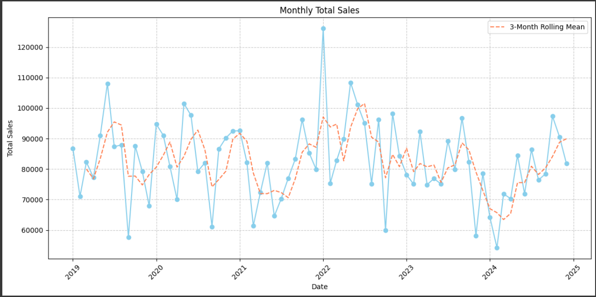
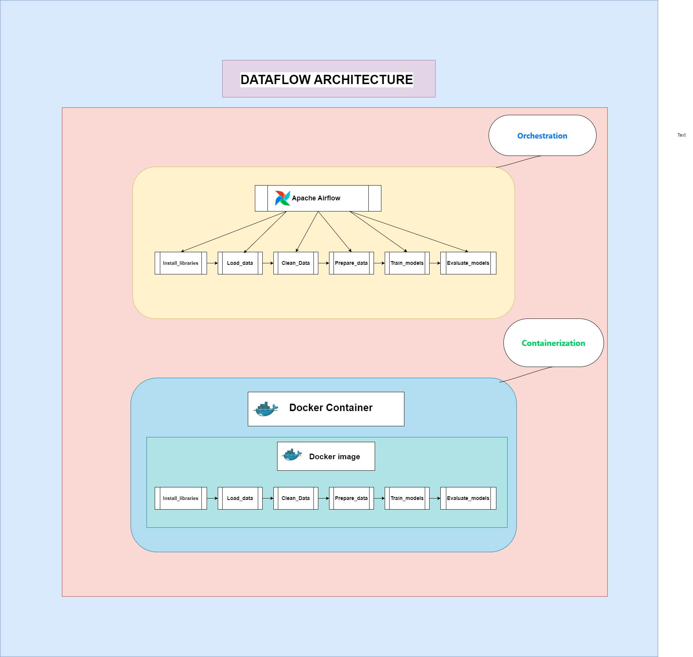

# 📈 Amazon Sales Analysis and Forecasting

This project involves analyzing Amazon sales data using time series analysis and forecasting future sales using various models. The models used include ARIMA, SARIMA, and LSTM, with LSTM providing the best performance based on RMSE and MPE scores. The entire project is containerized using Docker and orchestrated using Airflow, following the MLOps lifecycle.



---

## 📋 Table of Contents
- Project Overview
- Data
- Models
  - ARIMA
  - SARIMA
  - LSTM
- Evaluation
- Containerization
- Orchestration
- MLOps Lifecycle
- Installation
- Usage
- Contributing
- License

---

## 📖 Project Overview
The goal of this project is to analyze Amazon sales data and forecast future sales using time series analysis. We compare different models (ARIMA, SARIMA, and LSTM) and select the best model based on RMSE and MPE scores. The project is containerized using Docker and orchestrated using Airflow, ensuring an end-to-end MLOps lifecycle.



---

## 📊 Data
The dataset used for this project contains historical sales data from Amazon. The data is preprocessed and split into training and testing sets.

---

## 🧠 Models

### ARIMA
AutoRegressive Integrated Moving Average (ARIMA) is a popular statistical method for time series forecasting. It combines autoregression, differencing, and moving average components.

### SARIMA
Seasonal ARIMA (SARIMA) extends ARIMA by adding seasonal components to the model, making it suitable for data with seasonal patterns.

### LSTM
Long Short-Term Memory (LSTM) is a type of recurrent neural network (RNN) that is capable of learning long-term dependencies. It is particularly effective for time series forecasting.

---

## 📈 Evaluation
The models are evaluated based on Root Mean Squared Error (RMSE) and Mean Percentage Error (MPE). The LSTM model achieved the best performance with the lowest RMSE and MPE scores.

---

## 🐳 Containerization
The project is containerized using Docker, ensuring consistency and portability across different environments.

---

## 🌐 Orchestration
Airflow is used to orchestrate the entire workflow, from data preprocessing to model training and evaluation. This ensures a smooth and automated pipeline.

---

## 🔄 MLOps Lifecycle
The project follows the MLOps lifecycle, including:
- Data collection and preprocessing
- Model training and evaluation
- Model deployment
- Monitoring and maintenance

---

## 🛠️ Installation
To run this project, you need to have Docker and Airflow installed. Follow the steps below to set up the environment:

1. Clone the repository:
   ```bash
   git clone https://github.com/yourusername/amazon-sales-TSAF.git
   cd amazon-sales-TSAF
   ```

2. Build the Docker image:
   ```bash
   docker build -t amazon-sales-forecasting .
   ```

3. Start Airflow:
   ```bash
   docker-compose up -d
   ```

---

## 🚀 Usage
To use the project, follow these steps:

1. Access the Airflow web interface at `http://localhost:8080`.
2. Trigger the DAG to start the workflow.
3. Monitor the progress and view the results in the Airflow interface.

---

## 🤝 Contributing
Contributions are welcome! Please open an issue or submit a pull request for any improvements or bug fixes.

---

## 📜 License
This project is licensed under the MIT License. 
```
